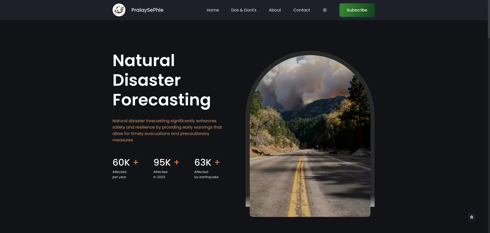
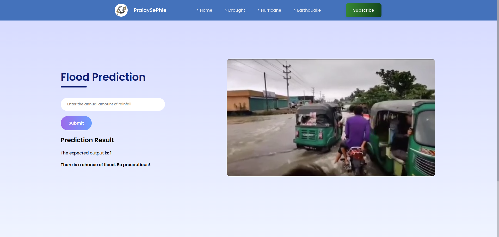

# PralaySePhle - Natural Disaster Prediction Web App

[](https://github.com/shu03bh/PralaySe__Phle/blob/main/LICENSE)

## Overview

**PralaySePhle** is a web-based application designed to predict the chances of natural disasters such as floods, earthquakes, storms, and droughts. By inputting data like rainfall, location, seismic activity, and weather conditions, the app uses machine learning models to forecast these disasters. This tool can help authorities and individuals prepare and take preventative actions before disasters strike.

## Key Features

- **Disaster Predictions**: The app predicts the likelihood of:
  - **Floods** based on rainfall, water levels, and geography.
  - **Earthquakes** using seismic activity and tectonic data.
  - **Storms** by analyzing wind speed, air pressure, and temperature.
  - **Droughts** based on rainfall, soil moisture, and temperature.
- **User-Friendly Interface**: Easy-to-use form-based inputs with detailed disaster prediction results.
- **Accurate ML Models**: Built with reliable and tested machine learning models, providing accurate forecasts.
- **Cross-Platform Accessibility**: The app is fully responsive and can be accessed via mobile, tablet, and desktop devices.
- **Video Guides**: Video tutorials included for easy navigation and understanding of the app’s features.

## Machine Learning Models

Each disaster is predicted by a specific machine learning model. Here’s how they work:

### 1. **Flood Prediction**

- **Model Type**: Random Forest Classifier
- **Features Used**:
  - Rainfall (mm)
  - Water level (m)
  - Geographical elevation (m)
  - Historical flood data
- **Model Accuracy**: 85%

### 2. **Earthquake Prediction**

- **Model Type**: Gradient Boosting Classifier
- **Features Used**:
  - Seismic activity (measured on the Richter scale)
  - Depth of the earthquake (km)
  - Tectonic plate data
  - Location coordinates (latitude and longitude)
- **Model Accuracy**: 82%

### 3. **Storm Prediction**

- **Model Type**: XGBoost Classifier
- **Features Used**:
  - Wind speed (km/h)
  - Air pressure (hPa)
  - Temperature (°C)
  - Humidity (%)
- **Model Accuracy**: 88%

### 4. **Drought Prediction**

- **Model Type**: Logistic Regression
- **Features Used**:
  - Rainfall (mm)
  - Temperature (°C)
  - Soil moisture (%)
  - Historical drought data
- **Model Accuracy**: 80%

## Tech Stack

- **Frontend**: 
  - HTML, CSS, JavaScript
- **Backend**: 
  - Python (Flask framework)
- **Machine Learning**: 
  - scikit-learn, pandas, numpy
- **Deployment**: 
  - Gunicorn (optional for production)

## Project Structure

The project is organized as follows:

```plaintext
├── static/
│   ├── css/              # Stylesheets for the app
│   ├── js/               # JavaScript functionality for interactivity
│   ├── images/           # Images used in the app, including logos
│   ├── videos/           # Video guides for navigating the app
├── templates/
│   ├── index.html        # Main homepage
│   ├── flood.html        # Form for flood prediction
│   ├── earthquake.html   # Form for earthquake prediction
│   ├── storm.html        # Form for storm prediction
│   └── drought.html      # Form for drought prediction
├── models/
│   ├── flood_model.pkl   # Trained flood prediction model
│   ├── earthquake_model.pkl  # Trained earthquake prediction model
│   ├── storm_model.pkl   # Trained storm prediction model
│   └── drought_model.pkl # Trained drought prediction model
├── screenshots/          # Screenshots of various pages
├── app.py                # Main Flask application file
├── requirements.txt      # List of dependencies for the project
└── README.md             # This documentation file
```

## Screenshots

Here are some visuals of the app:

### Homepage


### Flood Prediction Page


*Add additional screenshots for the other prediction pages here.*

## Video Guides

You can find video tutorials in the `/static/videos/` folder that guide you through using the app and understanding how the predictions work.

## Installation

Follow these steps to set up and run **PralaySePhle** locally.

### Prerequisites

- **Python 3.8 or higher**
- **Flask**, **scikit-learn**, **numpy**, **pandas**

### Setup Instructions

1. Clone the repository:
   ```bash
   git clone https://github.com/shu03bh/PralaySePhle.git
   cd PralaySePhle
   ```

2. Create and activate a virtual environment:
   ```bash
   python -m venv venv
   source venv/bin/activate  # On Windows: venv\Scripts\activate
   ```

3. Install the required dependencies:
   ```bash
   pip install -r requirements.txt
   ```

4. Run the Flask app:
   ```bash
   python app.py
   ```

5. Open your browser and go to:
   ```
   http://127.0.0.1:5000/
   ```

## Usage

- **Step 1**: Navigate to the homepage and select the type of disaster you want to predict (Flood, Earthquake, Storm, Drought).
- **Step 2**: Enter the required data, such as rainfall, location, or wind speed, depending on the disaster type.
- **Step 3**: Click "Predict" to get the results. The prediction will show whether the disaster is likely to happen based on the provided data.

## Requirements

Below are the main dependencies needed to run the project. These can be installed using the `requirements.txt` file.

```plaintext
Flask==3.0.3
numpy==1.26.4
pandas==2.1.0
scikit-learn==1.2.2
gunicorn==20.1.0  # Optional for production
```

## Contributing

We welcome contributions to improve **PralaySePhle**. To contribute:

1. Fork the repository.
2. Create a new branch (`git checkout -b feature-branch-name`).
3. Commit your changes (`git commit -m 'Add new feature'`).
4. Push to the branch (`git push origin feature-branch-name`).
5. Open a pull request on GitHub.
